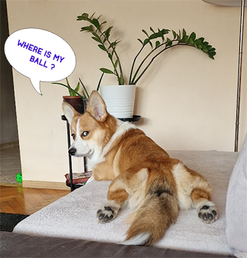
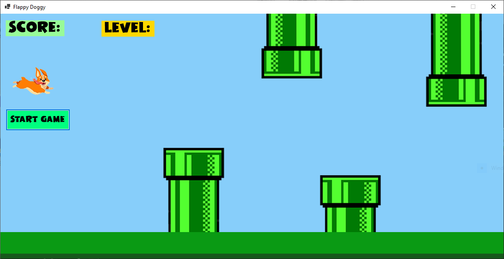
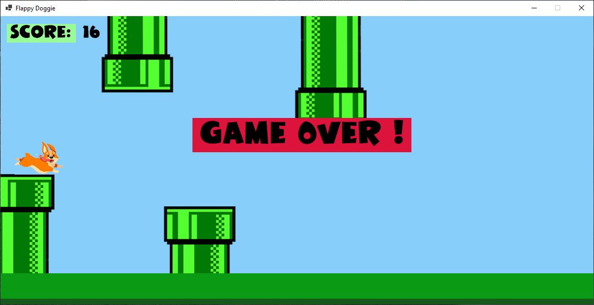

# Flappy-Doggie-Game-by-I-M-Marinov

## Description:

- Simple Windows Forms game
  
## Technology stack:
- C#
- .NET Core
- Photoshop CS6 ( some of the images ) + unsplash.com
- Figma
  

## Features
- A C# Game that resembles the famous "Flappy Bird" game that took over the world in 2013 ( originally created by Dong Nguyen ).
- Instead of a Bird, your playable character is a Corgi dog ( inspired by my own corgi doggie Joey ) 
- Use the arrows to avoid the obstacles ( pipes ) and gain a point for every pipe/obstacle that you miss.

## Screenshots: 

## Planned updates:

- Restart Button ( because currently if the game is over you would have to restart the application to play again ) 
- High Scores
- Pause button

  

 
