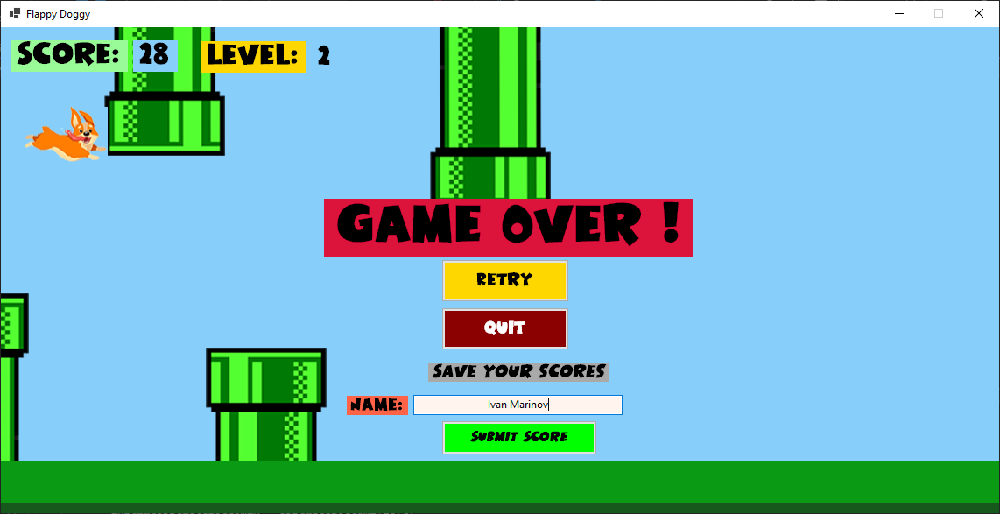
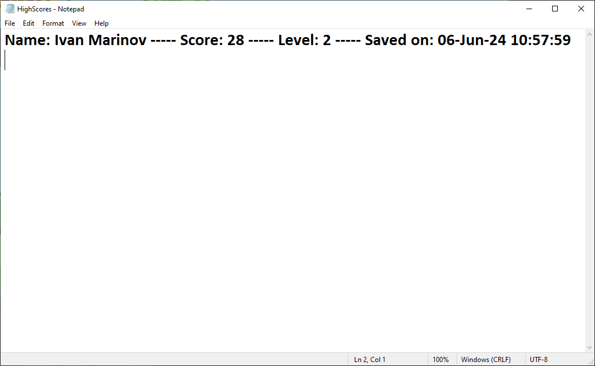

# Flappy-Doggy-Game-by-I-M-Marinov

## Description:

- Simple Windows Forms game
  
## Technology stack:
- C#
- .NET Core
- Photoshop CS6 ( some of the images ) + unsplash.com
- Figma
- Little Dinosour Font ( https://www.1001fonts.com/little-dinosaur-font.html )
  

## Features
- A C# Game that resembles the famous "Flappy Bird" game that took over the world in 2013 ( originally created by Dong Nguyen ).
- Instead of a Bird, your playable character is a Corgi dog ( inspired by my own corgi doggy Joey ) 
- Use the arrows to avoid the obstacles ( pipes ) and gain a point for every pipe/obstacle that you miss.

## Screenshots: 

## Last Updates: 

- Retry Button added, so the user can restart the game without restarting the application
- Game speed increases every 20 points ( 20 pipes evaded )
- Added a label that helps the player see which is the current level of speed in-game
- The pipes disappear when the game is over, so the player has a more clear view of the butoons and the high score input field.
- Added High Scores that output on a txt file ( currently in the game folder ). If a user tries to add a high score without wiriting a name in, it does not let him. If a user's name is already present in the High Scores txt file and the high score is bigger than the user's current score it does not let him override it. If the user beats his high score it deletes the last score and puts the new high score in. 

## Planned updates:

- Pause button
- Background music and sounds when the doggy is moving up or down 

  

 
